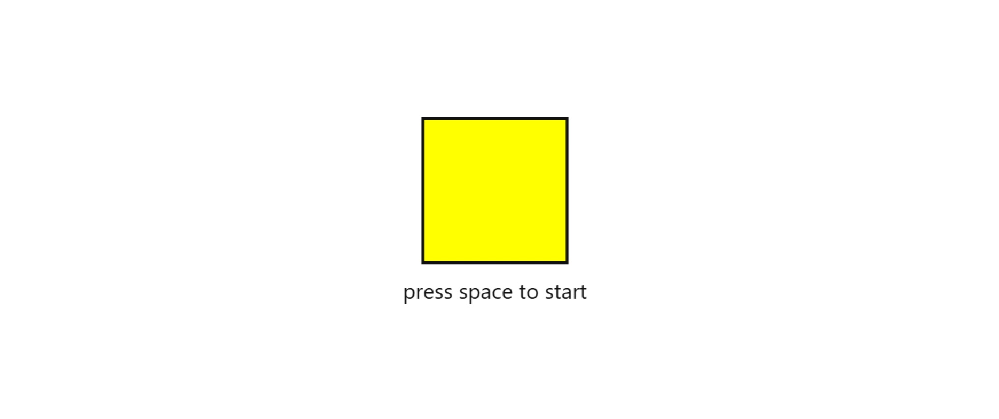
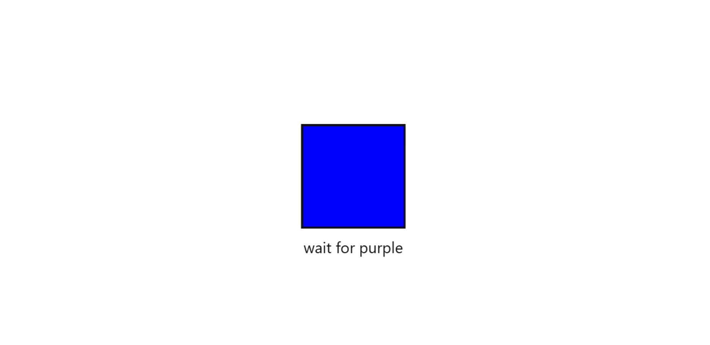
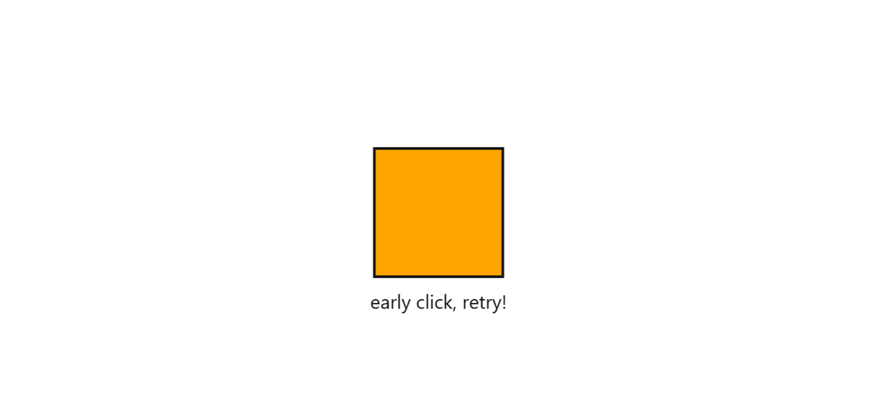
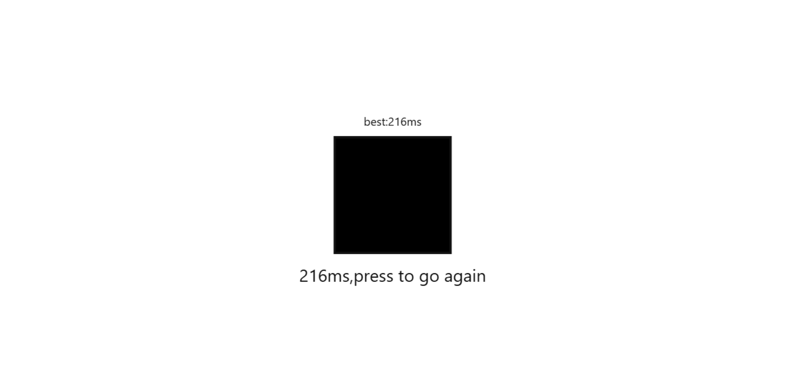

# REACTION TIME GAME

## HOW TO PLAY

1. press space or click to start.
2. wait for the box to turn purple
3. click as fast as you can.

## ABOUT

i made this project for shrink using canvas and webAudio api, the whole app has to fit in a single 'data:' URL under 3kb. just a simple reaction time test game, most reaction time test games use green and red which is obvious but it was too basic so i added different colors just to make it random and fun :p

